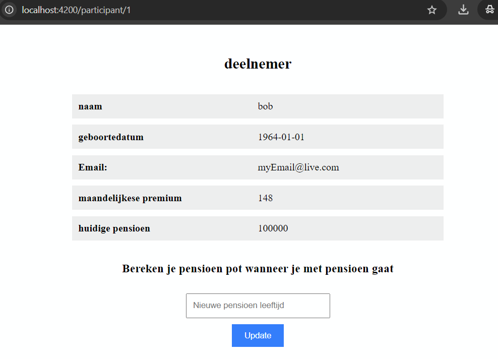
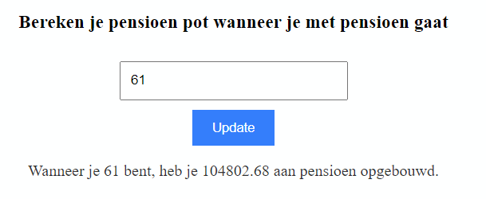
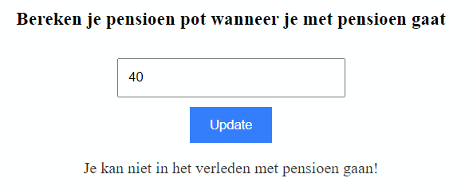

## applicatie
### Wanneer je de pagina opent zie je meteen de klant gegevens opgehaald van de api

### je ziet de verwachte pensioen waarde bij correct leeftijd (in de toekomst)

### simpele error bij pensioen leeftijd in het verleden 

# starten van applicatie
## backend
### dependencies
- docker desktop moet geinstaleerd zijn en opgestart voor de database connectie
### starten van api
- ./mvnw spring-boot:run
## frontend starten
- npm install
- npm start

